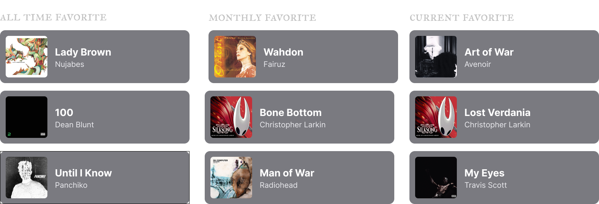

# hi, i'm Luluwah 👋

Senior IT student at Princess Nourah Bint Abdulrahman University, building in **machine learning**, **full-stack web**, and **XR/VR**.

---

## i do listen to music frequently 🎧

  

---

## 🛠 what i build with

  

## 🚀 projects
- **[MediRemi](https://github.com/LuluwahGW/MedicationReminderBackEnd.git)** : Medication Reminder web developed by using Python, FastAPI, Javascript, CSS, HTML. Built secure JWT authentication with reminder and medication management features, and caregiver-patient system for medication tracking.
- **[Learning ML from scratch](https://github.com/LuluwahGW/HousePred.git)**: Developed a machine learning model using python to predict house prices using kaggle house prices dataset, performing data analysis, preprocessing, model training and evaluation.

## 📫 reach me

[LinkedIn](https://linkedin.com/in/luluwah-algaraawe) · [Email](mailto:luluwahalgw@gmail.com) · [Portfolio](https://YOUR_SITE)
